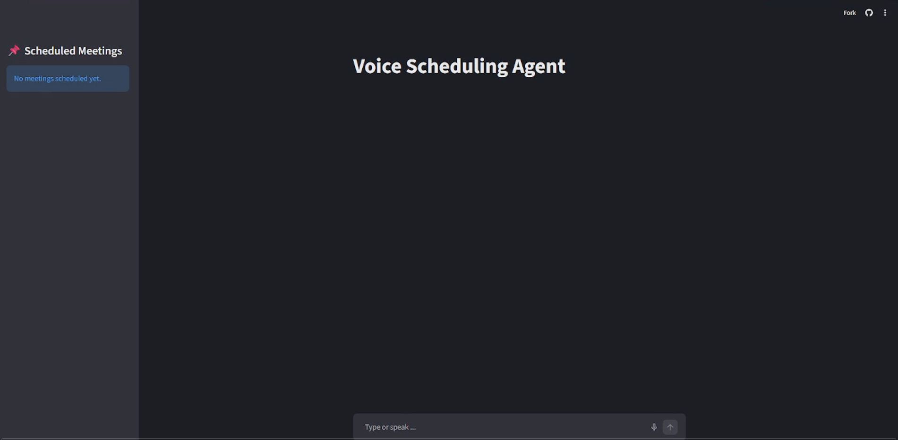
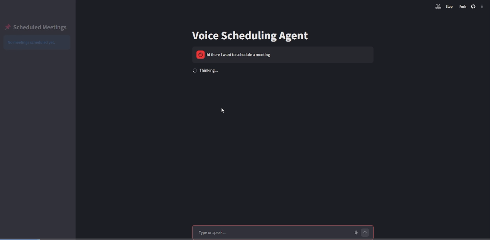
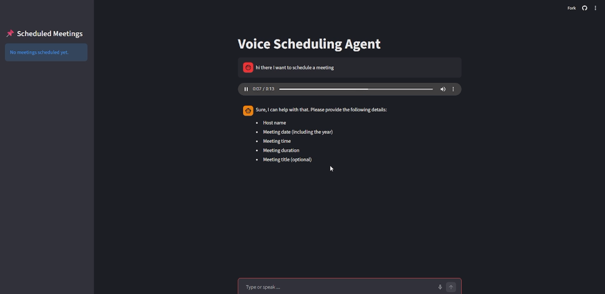
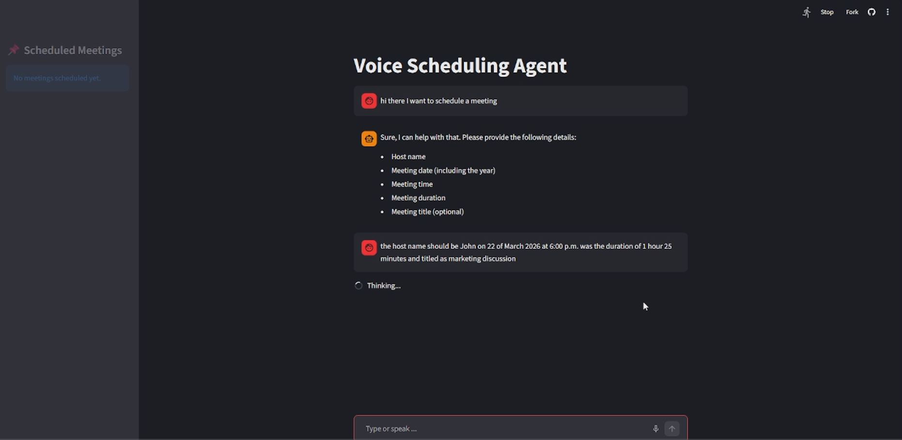
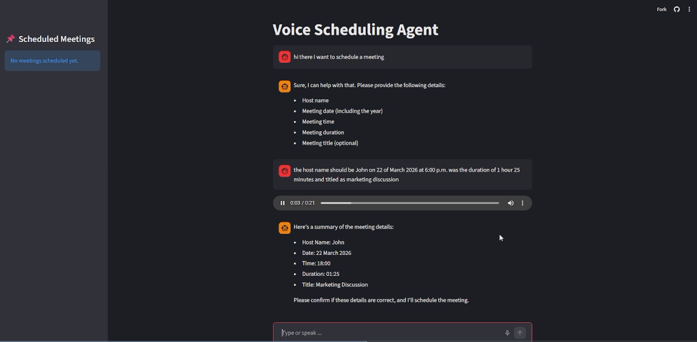
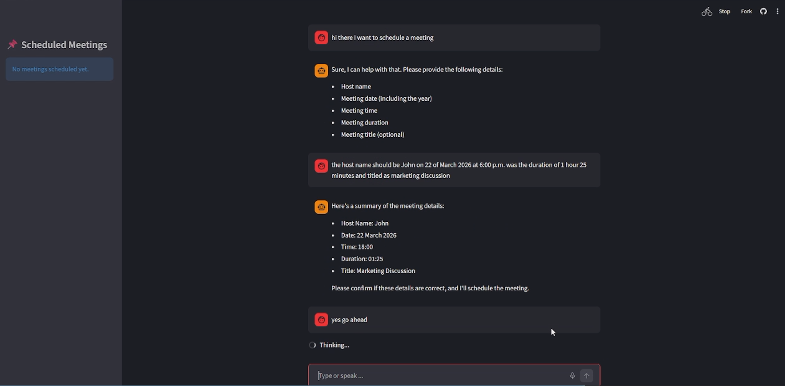
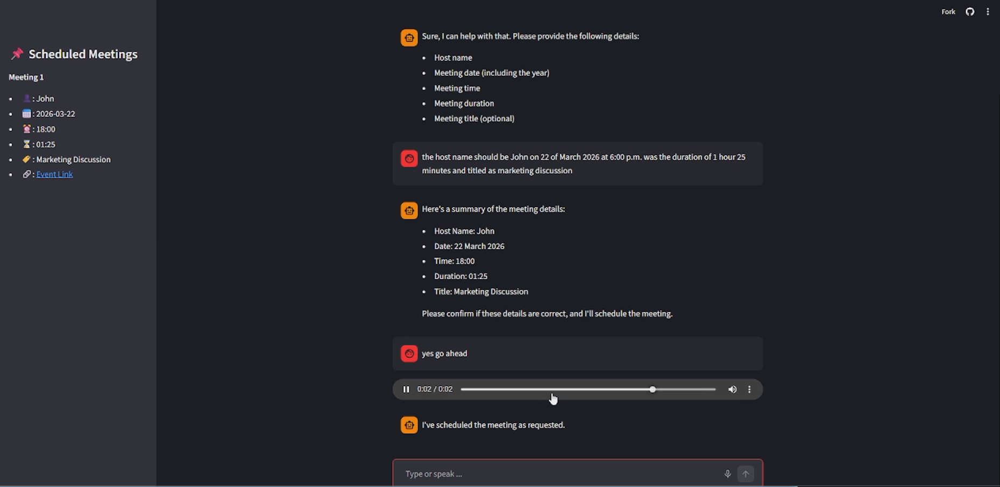
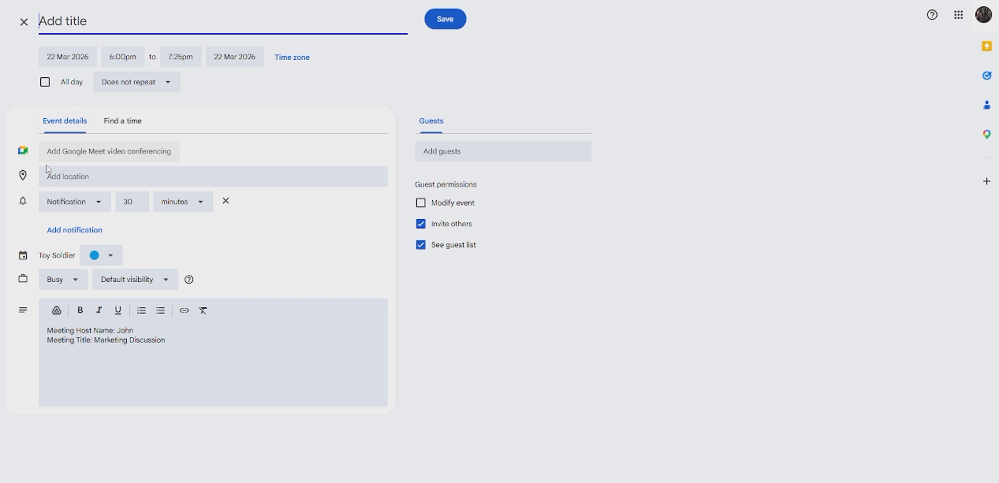

# Steps to Test the Agent
1. Go to this [link](https://voice-scheduling-agent-qepq4rvqkq3tje7rr5xkap.streamlit.app/).
2. Use the chat interface (voice or text) to ask the agent to schedule a meeting.
3. Provide the meeting details.
4. After the agent confirms that the event is scheduled, the event will be added to the Scheduled Meetings sidebar.
5. Click on the created event link from the Scheduled Meetings sidebar.
6. You'll be redirected to the Google Calender event page.
# Steps to Run Locally (Windows)
1. Clone the git repository.
2. Install **Python 3.13** from this [link](https://www.python.org/downloads/windows/).
3. Open **Windows PowerShell** in the root directory of the project.
4. Execute the following command to create the environment:
```powershell
python -m venv .venv
```
5. Execute the following command to activate the environment:
```powershell
.venv\Scripts\Activate.ps1
```
, if you get an ExecutionPolicy block, re-open **Windows PowerShell** as *admin*, then execute the following commands:
```powershell
Set-ExecutionPolicy -ExecutionPolicy RemoteSigned -Scope CurrentUser
.venv\Scripts\Activate.ps1
```
6. Execute the following command to install the project dependencies:
```powershell
pip install -r requirements.txt
```
7. Create a *secrets.toml* file in a *.streamlit* directory, then add this line to it:
```
COHERE_API_KEY=<your_cohere's_api_key>
```
8. Execute the following command to run the application:
```powershell
streamlit run app.py
```
# Explanation of the Calendar Integration
This project integrates with Google Calendar by generating a **pre-filled event creation link**.

---
## How It Works
When a meeting is confirmed, the backend generates a URL using:
```
https://www.google.com/calendar/render?action=TEMPLATE
```
This link opens the Google Calendar UI with event details already filled in.

---
## Parameters Used
The following query parameters are appended to the URL:
### 1. `action=TEMPLATE`
* Instructs Google Calendar to open the **event creation page**
---
### 2. `dates`
Defines the meeting start and end time in the format:
```
YYYYMMDDTHHMMSS/YYYYMMDDTHHMMSS
```
Example:
```
20260325T140000/20260325T150000
```
* First part → Start timestamp
* Second part → End timestamp
The backend calculates this using:
* `datetime.strptime()` → parse date & time
* `timedelta()` → add duration
---
### 3. `details`
Contains meeting details such as:
```
Meeting Host Name: John
Meeting Title: Project Sync
```
This helps provide context inside the calendar event.

---
## Timestamp Generation Logic
The system converts user input into timestamps:
* Input:
  * Date → `YYYY-MM-DD`
  * Time → `HH:MM`
  * Duration → `HH:MM`
* Process:
  1. Combine date and time → start datetime
  2. Parse duration → hours + minutes
  3. Add duration → end datetime
  4. Format both timestamps into Google Calendar format
---
## Example Generated Link
```
https://www.google.com/calendar/render?action=TEMPLATE
&dates=20260325T140000/20260325T150000
&description=Meeting Host Name: John
Meeting Title: Project Sync
```
Opening this link will:
* Launch Google Calendar
* Pre-fill event details
* Allow the user to review and save the event
---
# Screenshots








# Video
[Link](https://drive.google.com/file/d/1RfNqmP8U25lInD9F3-Pxe9T2VXOP-nzv/view?usp=sharing).